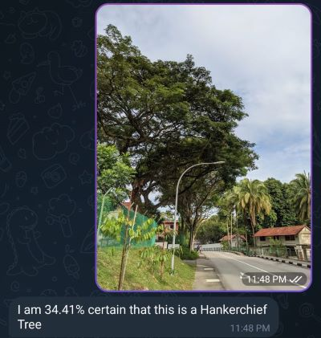

# Content

1. About
2. Computer Vision Work
    - Implementing Works
    - Computer Vision Templates
    - Computer Vision Applications
3. Other Works

# About

Hi!

This is a place to show my work. The main focus is on deepening my knowledge of Computer Vision (especially in CNNs).  

Yes I am bad at HTML hence Markdown. 

# Computer Vision Work

## Implementing Networks
---

### MobileNet [(Repo)](https://github.com/tappyness1/mobilenet)

- Implement MobileNetV1 and V2 with PyTorch with Training and Validation.
- Main challenge was the need to create Depthwise Separable Convolution with V1, and the Expansion-Separation-Projection block along with the Identity funciton in V2.
- Did not pursue V3 as it did not seem to introduce new concepts, but tried to reduce the network for small devices.

### ResNet [(Repo)](https://github.com/tappyness1/ResNet-Implementation)

- Implement Residual Network - 34/51/102/216 using PyTorch 
- Main Challenge was that this was my first Network to be implemented besides the usual basic CNN. Aside from that, it opened my mind to the Identity Block and how to design PyTorch network to accomodate the Block. 
- I used [Torchvision's ResNet repo](https://github.com/pytorch/vision/blob/main/torchvision/models/resnet.py) as a reference when building it. 

### TripletLoss [(Repo)](https://github.com/tappyness1/triplet-loss-revisit)

- Implement TripletLoss. This is the workflow that most people know as Siamese Network/One-Shot Learning and is used for such things like face recognition. The term TripleLoss is not a network, but the loss function for training the models.
- For FashionMNIST dataset, I used the Siamese Network with TripletLoss, and it was able to achieve reasonably good results. 
- For Flowers102 dataset, I used ResNet. It was not able to achieve much.   

## Templates
---

### Computer Vision PyTorch CookieCutter Template [(Repo)](https://github.com/tappyness1/pytorch-boilerplate)

- When implementing Networks, it helped me to have a template/cookiecutter so I can concentrate on the Network instead of coding up the dataloader/training/validation scripts every time.

- Includes Hydra configuration and Optuna for hyperparameter tuning.

## Computer Vision Application
---

### Classifying Trees in Singapore [(Repo)](https://github.com/tappyness1/sg_tree_classifier)

- This was a project done in 2020 when I first learned about how to do an end-to-end pipeline for classifying objects
- The model was a simple CNN classifier using images scraped from Google using the classification as suggested in Singapore's National Parks statutory board. 
- Packaged as Telegram bot. At the time Heroku hosted the code and engine. However, Heroku has removed the free tier and hence there is no engine currently.