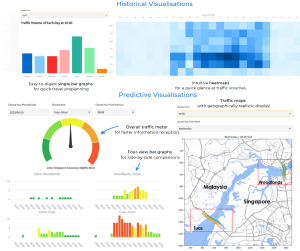
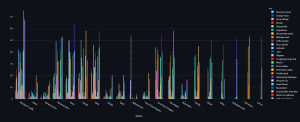

# Content

1. About
2. [Computer Vision Work](#computer-vision-work)
    - Implementing Works
    - Computer Vision Templates
    - Computer Vision Applications
3. [Other Works](#other-works)
4. [In the Works](#future-works)

# About

Hi!

This is a place to show my work. The main focus is on deepening my knowledge of Computer Vision (especially in CNNs). 

The two works I'm currently most proud of:

[Causion](#causion) - how I used Object Detection to help analyse the world's busiest causeway

[Error Analysis for Computer Vision Tasks](#error-analysis-for-computer-vision-tasks) - Built sample templates for object detection and instance segmentation analysis

# Computer Vision Work

## Implementing Networks
---

### MobileNet [(Repo)](https://github.com/tappyness1/mobilenet)

- Implement MobileNetV1 and V2 with PyTorch with Training and Validation.
- Main challenge was the need to create Depthwise Separable Convolution with V1, and the Expansion-Separation-Projection block along with the Identity funciton in V2.
- Did not pursue V3 as it did not seem to introduce new concepts.

### ResNet [(Repo)](https://github.com/tappyness1/ResNet-Implementation)

- Implement Residual Network - 34/51/102/216 using PyTorch 
- Main Challenge was that this was my first Network to be implemented besides the usual basic CNN. Aside from that, it opened my mind to the Identity Block and how to design PyTorch network to accomodate the Block. 
- I used [Torchvision's ResNet repo](https://github.com/pytorch/vision/blob/main/torchvision/models/resnet.py) as a reference when building it. 

### TripletLoss [(Repo)](https://github.com/tappyness1/triplet-loss-revisit)

- Implement TripletLoss. This is the workflow that most people know as Siamese Network/One-Shot Learning and is used for such things like face recognition. The term TripleLoss is not a network, but the loss function for training the models.
- For FashionMNIST dataset, I used the Siamese Network with TripletLoss, and it was able to achieve reasonably good results. 
- For Flowers102 dataset, I used ResNet. It was not able to achieve much.

## Computer Vision Templates
---

### Computer Vision PyTorch CookieCutter Template [(Repo)](https://github.com/tappyness1/pytorch-boilerplate)

- When implementing Networks, it helped me to have a template/cookiecutter so I can concentrate on the Network instead of coding up the dataloader/training/validation scripts every time.

- Includes Hydra configuration and Optuna for hyperparameter tuning.

### Error Analysis for Computer Vision tasks

- In evaluating Object Detection and Image Segmentation models, there is a tendency to simply look at mean Average Precision with some Intersection over Union threshold. However, often that is not enough for the end user of your products. The main question is, is the model actually able to detect something?

- Hence, I created a simple minimal tool for quick visualisation of the models you use.

- [Template for Segmentation Analysis](https://huggingface.co/spaces/tappyness1/error-analysis-cv-segmentations)

- [Template for Detection Analysus](https://huggingface.co/spaces/tappyness1/error-analysis-cv)

## Computer Vision Application
---

### Classifying Trees in Singapore [(Repo)](https://github.com/tappyness1/sg_tree_classifier)

- This was a project done in 2020 when I first learned about how to do an end-to-end pipeline for classifying objects
- The model was a simple CNN classifier using images scraped from Google using the classification as suggested in Singapore's National Parks statutory board. 
- Packaged as Telegram bot. At the time Heroku hosted the code and engine. However, Heroku has removed the free tier and hence there is no host currently.

### Causion 

[Repo](#https://huggingface.co/spaces/GT6242Causion/Causion)

- The Singapore-Johor causeways see as many as 350000 daily crossings. There are obvious problems such as delays and traffic noise, which is a drop in the quality of life for those involved. My team built an app which aimed to help the commuters by helping them analyse the traffic conditions to help them plan ahead. 
- Used YOLOv4tiny to detect and count vehicles on the causeway every half an hour. 
- Using these counts and the timestamps, translated them into useful analytic visualisation.

# Other Works

### OneDash [(Repo)](https://github.com/tappyness1/onedash)

- This was a project done in 2021 while on a 2-week break before starting my job as AI Engineer. 
- One Piece is my favourite manga. I wanted to build something related to it with the skills I've built back then. 
- The data was scraped in [One Piece Wikia](https://onepiece.fandom.com/wiki/One_Piece_Wiki) with visualisation using Streamlit and Dash.
- As with Tree Classifier project, this is not hosted anywhere currently since Heroku removed the free tier. However, the streamlit app can still be run with local host.

# Future Works

### Port Heroku applications to HuggingFace
### Retooling Computer Vision Error Analysis